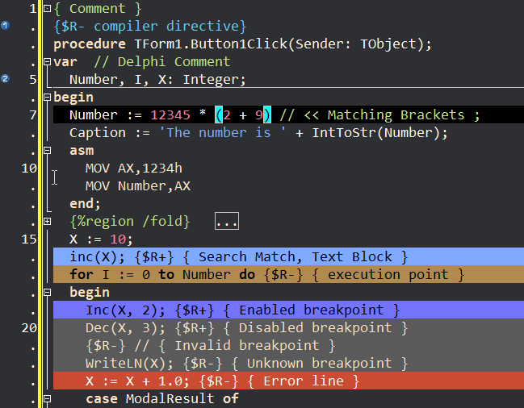

Dark color scheme for Lazarus which looks like modern Delphi dark scheme with some improvements from CnPack.

How to use:
- create folder `%lazarus%\userschemes\`
- copy `ColorDelphiDark.xml` into this folder
- open Lazarus options (Tools - Options - Editor - Display - Colors) and select "Delphi Dark" color scheme.

`%lazarus%` is the folder where Lazarus keeps its settings:
- `~/.lazarus` under Linux, macOS
- `C:\Users\<User name>\AppData\Local\lazarus\` under Windows

