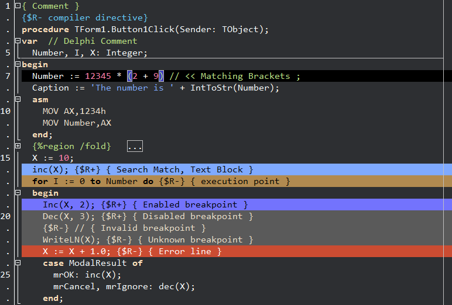

Two Dark color schemes for Lazarus that look like modern Delphi Dark scheme:

- `ColorDelphiDark.xml` - original Delphi Dark theme;
- `ColorDelphiDarkMod.xml` - Delphi Dark theme with some color changes from CnPack (brackets color, word highlight, margin color).

How to use:
- create folder `%lazarus%\userschemes\`
- copy `ColorDelphiDark.xml` into this folder
- open Lazarus options (Tools - Options - Editor - Display - Colors) and select "Delphi Dark" color scheme.

`%lazarus%` is the folder where Lazarus keeps its settings:
- `~/.lazarus` under Linux, macOS
- `C:\Users\<User name>\AppData\Local\lazarus\` under Windows

